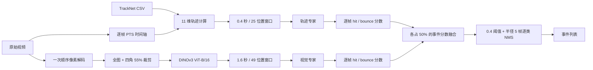

# 模型结构与推理原理

本文说明 `trajectory-visual-fusion-v1` 的完整推理计算。模型以原始视频和与视频逐帧
对齐的 TrackNet CSV 为输入，为每一帧输出 `hit`（击球）和 `bounce`（落地）分数，
再通过固定阈值和逐类非极大值抑制生成离散事件。

模型由三个部分组成：轨迹专家、五视图视觉编码器和视觉专家。轨迹专家从球的时空
轨迹判断事件；五视图视觉编码器从整幅画面及四个角区提取语义特征；视觉专家聚合
区域和时间信息。两位专家独立给出类别分数，最后执行事件分数融合。

## 总体流程

这是居中时间窗模型。轨迹专家观察中心时刻前后各 `0.2` 秒，视觉专家观察前后各
`0.8` 秒，因此完整融合结果需要约 `0.8` 秒的未来画面。当前实现按整段视频离线推理。

## 张量记号

| 记号 | 含义 |
|---|---|
| `N` | 视频总帧数，也是最终逐帧分数的数量 |
| `B` | 一次送入事件专家的中心帧数量 |
| `M` | 一次送入五视图视觉编码器的图像数量 |
| $T_{\mathrm{traj}}$ | 轨迹窗口位置数，固定为 `25` |
| $T_{\mathrm{visual}}$ | 视觉窗口位置数，固定为 `49` |
| `R` | 视觉区域数，固定为 `5` |
| $D_{\mathrm{DINO}}$ | 每个视图的视觉特征维度，固定为 `768` |
| `H` | 两位事件专家的内部隐藏维度，固定为 `64` |

主要张量形状如下：

| 阶段 | 形状 | 数据类型 |
|---|---:|---|
| 轨迹基础行 | `[N, 10]` | `float32` |
| 轨迹专家输入 | `[B, 25, 11]` | `float32` |
| 视觉编码器输入 | `[M, 3, 256, 256]` | CPU 为 `float32`；CUDA 前向使用 autocast |
| 单视图 CLS 特征 | `[M, 768]` | 编码后转存为 `float16` |
| 每帧五视图特征 | `[N, 5, 768]`，展平为 `[N, 3840]` | CPU `float16` |
| 视觉专家输入 | `[B, 49, 3840]` | 存储为 `float16`，投影前转为 `float32` |
| 单专家事件性 logit | `[B]` | `float32` |
| 单专家类别 logits | `[B, 2]` | `float32` |
| 最终逐帧类别分数 | `[N, 2]` | `hit`、`bounce` |

## PTS 时间轴与窗口采样

所有时间计算使用视频包的 PTS 和视频流 `time_base`。CSV 中即使带有 FPS 字段，也不
参与窗口计算。视频 FPS 仅作为输出元数据报告。

对中心帧 `i`，其真实时间为 $t_i$。每位专家先在固定秒数范围内生成等距目标位置：

$$
q_{i,j}=t_i+o_j
$$

轨迹偏移 $o_j$ 是从 `-0.2` 到 `+0.2` 秒的 25 个等距值；视觉偏移 $o_j$ 是从
`-0.8` 到 `+0.8` 秒的 49 个等距值。它们分别对应约 `1/60` 秒和 `1/30` 秒的目标
间隔，但采样不假定视频采用 60 FPS 或 30 FPS。

每个目标位置从真实 PTS 中选择时间距离最近的帧。若左右两帧距离完全相同，选择较早
的 PTS。可变帧率、掉帧或低帧率视频可能让相邻目标位置重复选择同一真实帧，这是最近
PTS 采样的预期结果。

目标位置落在视频 PTS 范围之外时，该位置被标记为 padding，并将输入向量全部置零。
因此窗口长度始终固定，视频首尾不通过复制边界帧来补齐。

轨迹窗口的第 11 维不是规则网格的 $o_j$，而是实际选中帧相对中心帧的时间：

$$
\text{time\_offset}_{i,j}=t_{k(i,j)}-t_i
$$

padding 位置的 `time_offset` 为零。这一设计保留了最近 PTS 采样后实际发生的时间偏差。
视觉窗口不追加时间偏移维度。

## 轨迹输入的 11 个维度

CSV 坐标来自原始视频分辨率。推理先将稀疏 CSV 对齐到 `N` 个真实视频帧，再为每个
真实帧生成 10 维基础行；取窗时追加 `time_offset`，得到 11 维输入。

| 索引 | 名称 | 定义 |
|---:|---|---|
| 0 | `x_norm` | 检测点横坐标除以原图宽度 |
| 1 | `y_norm` | 检测点纵坐标除以原图高度 |
| 2 | `detected` | 该真实帧是否有球检测，取 `0` 或 `1` |
| 3 | `dx` | 单位秒内的归一化横向位移 |
| 4 | `dy` | 单位秒内的归一化纵向位移 |
| 5 | `speed` | $\sqrt{d_x^2+d_y^2}$ |
| 6 | `acceleration` | 速度对时间的中点差分 |
| 7 | `angle_change` | 相邻有效方向的最小夹角绝对值，再除以 $\pi$ |
| 8 | `curvature` | 经过 `log1p` 压缩的转向速率与速度之比 |
| 9 | `valid` | 采样位置是否位于真实视频 PTS 范围内 |
| 10 | `time_offset` | 选中帧 PTS 相对中心帧 PTS 的真实秒数 |

`detected` 和 `valid` 表达不同事实。真实视频帧即使没有球检测，仍有 `valid=1`、
`detected=0`；只有时间窗越过视频首尾形成的 padding 才是 `valid=0`。轨迹专家的时间
池化使用 `valid`，不会把真实但缺少球检测的帧当成窗口外 padding。

CSV 可以跳过没有检测的帧。未提供的帧与显式 `detected=0` 的帧都按无检测处理。
`x_orig` 和 `y_orig` 只在 `detected=1` 时读取；最终事件坐标仍使用这两个原图像素坐标，
它们不会直接送入网络。

### 速度、中点加速度与曲率

以下 $i$ 表示按时间排列的检测点序号，$x_i,y_i$ 是经过 `float32` 量化的归一化坐标，
不是原图像素坐标。设当前检测帧与上一检测帧的 PTS 间隔为 $\Delta t_i$。只有
$0 < \Delta t_i \leq 0.2$ 秒时才计算这一段的运动量：

$$
d_x=\frac{x_i-x_{i-1}}{\Delta t_i},\qquad
d_y=\frac{y_i-y_{i-1}}{\Delta t_i},\qquad
v_i=\sqrt{d_x^2+d_y^2}
$$

若已有上一段速度和上一段时长 $\Delta t_{i-1}$，导数时间位于相邻速度段的中点：

$$
\delta_i=\frac{\Delta t_{i-1}+\Delta t_i}{2},\qquad
a_i=\frac{v_i-v_{i-1}}{\delta_i}
$$

新连续段的第一条速度没有上一段速度，`acceleration` 置零，其导数时长直接使用当前
$\Delta t_i$。

非零速度的方向为 $\operatorname{atan2}(d_y,d_x)$。相邻方向变化取环形角度上的最短距离
$\Delta\theta_i\in[0,\pi]$，输入中的 `angle_change` 为 $\Delta\theta_i/\pi$。曲率特征为：

$$
\text{curvature}_i=
\log\left(1+\frac{\Delta\theta_i/\delta_i}
{\max(\bar v_i,10^{-6})}\right)
$$

若存在上一段速度，$\bar v_i=(v_{i-1}+v_i)/2$；否则使用当前速度。连续段的第一条速度没有
可比较方向，所以角度变化和曲率均为零。

当相邻检测之间超过 `0.2` 秒，当前检测行不跨越断轨计算速度，同时清空上一段速度、
时长和方向。下一条在 `0.2` 秒内到达的检测会以当前检测为新起点。

坐标除以宽高后立即量化为 `float32`，再计算差分。这会把小于 `float32` 分辨能力的
位移视作精确静止。速度为零时方向记为不可用，不把它解释成零弧度方向，也不使用它
计算下一次角度变化。

### 固定归一化

推理不从输入视频估计任何统计量。8 个连续轨迹量使用权重文件内固定的中位数和 IQR
常量进行归一化，并截断到 `[-5, 5]`：

$$
z=\operatorname{clip}\left(\frac{x-\text{median}}{\text{IQR}},-5,5\right)
$$

| 特征 | 中位数 | IQR |
|---|---:|---:|
| `x_norm` | 0.505859375 | 0.175781250 |
| `y_norm` | 0.378472209 | 0.319444478 |
| `dx` | 0 | 0.117070429 |
| `dy` | 0 | 0.416251510 |
| `speed` | 0.239030033 | 0.411576807 |
| `acceleration` | 0 | 4.562701225 |
| `angle_change` | 0.043753602 | 0.163099155 |
| `curvature` | 1.924172401 | 3.682075739 |

归一化只应用于 `detected=1` 且 `valid=1` 的行。其他行的这 8 个连续量强制为零。
`detected`、`valid` 和 `time_offset` 保持原值，不参与中位数/IQR 变换。

## 轨迹专家

轨迹专家接收 `[B, 25, 11]`。其完整计算顺序为：

1. 线性投影到 64 维。
2. 对每个时间位置做 64 维 LayerNorm、GELU 和 dropout。
3. 经过三个保持时间长度的残差一维卷积块。
4. 经过单层双向 GRU。
5. 拼接中心、有效位置均值和有效位置最大值。
6. 分别送入事件性头和事件类别头。

权重文件中的输入投影矩阵形状为 `[64, 779]`，偏置形状为 `[64]`。推理明确只使用
投影矩阵的前 11 列，即实际线性输入严格是上述 11 维。其余 768 列随权重保留以维持
完整的参数结构，但不参与前向计算。

每个残差卷积块包含 `Conv1d(64, 64, kernel_size=5, padding=2)`、GELU、`0.25`
dropout、残差相加和 64 维 LayerNorm。三个块参数各自独立。卷积在时间轴上运算，
padding 保证输出仍为 25 个位置。

推理时 dropout 关闭，一个残差卷积块可写为：

$$
Y=\operatorname{LayerNorm}\left(X+\operatorname{GELU}\left(\operatorname{Conv1d}_{k=5}(X)\right)\right)
$$

三个步长为 1 的卷积块在时间轴上的理论局部感受野为：

$$
L=1+3(5-1)=13
$$

13 个轨迹采样位置首尾约跨 0.2 秒；随后双向 GRU 仍读取完整的 0.4 秒窗口。
这里的感受野描述卷积阶段，不是整个专家的时间范围。

双向 GRU 每个方向的隐藏维度为 64，输出为 `[B, 25, 128]`。池化从该输出提取：

- 窗口中心位置：`[B, 128]`；
- 所有 `valid=1` 位置的掩码均值：`[B, 128]`；
- 所有 `valid=1` 位置的掩码最大值：`[B, 128]`。

三者拼接为 `[B, 384]`。如果某个构造输入的窗口完全无有效位置，均值分母至少为 1，
最大值中的无穷占位会替换成零，因而输出保持有限。正常逐帧推理中中心帧本身有效。

## 五视图视觉编码器

每个 RGB 视频帧生成五个视图，顺序固定为：

1. 完整画面；
2. 左上区域；
3. 右上区域；
4. 左下区域；
5. 右下区域。

四个区域直接从原始 RGB 帧裁剪。裁剪高宽分别为
$\lceil 0.55\,h_{\mathrm{image}}\rceil$ 和 $\lceil 0.55\,w_{\mathrm{image}}\rceil$，因此相对的两个角区在每条轴上
有约 10% 画面尺寸的重叠。裁剪不依赖球坐标或轨迹定位。

五个视图先将 `uint8` 像素转换为 `[0, 1]` 的 `float32`，再直接抗锯齿缩放至
`256 × 256`，最后按通道执行 ImageNet 归一化：

| 通道 | mean | std |
|---|---:|---:|
| R | 0.485 | 0.229 |
| G | 0.456 | 0.224 |
| B | 0.406 | 0.225 |

### DINOv3 ViT-B/16 前向

同一套 DINOv3 ViT-B/16 权重编码全图和四个区域。输入 `[M, 3, 256, 256]` 先经过
`Conv2d(3, 768, kernel_size=16, stride=16)`，形成 $16\times16=256$ 个 patch token。

序列在 patch token 前增加 1 个 CLS token 和 4 个 storage token，因此 Transformer
序列长度为 $1+4+256=261$，每个 token 宽度为 768。模型中保留 mask token 参数
以完整加载权重；此推理路径不遮蔽输入 patch。

骨干包含 12 个 Transformer block。每个 block 使用预归一化结构：

1. 768 维 LayerNorm，`eps=1e-5`；
2. 12 头自注意力，每头 64 维；
3. 第一组 LayerScale 后残差相加；
4. 768 维 LayerNorm，`eps=1e-5`；
5. `768 → 3072 → 768` 的 MLP，中间使用 GELU；
6. 第二组 LayerScale 后残差相加。

QKV 由一个带偏置的 `768 → 2304` 线性层生成，权重规定 key 部分的偏置为零。
注意力使用缩放点积计算。MLP 内 dropout 为 `0.0`。LayerScale 的 768 个系数属于加载
权重；网络构造时初值为 `1e-5`。

二维旋转位置编码作用于 patch token 的 query 和 key，5 个前缀 token 不旋转。位置
坐标取每个 patch 中心，将行列坐标分别映射到 `[-1, 1]`，每个轴使用 16 个周期，组合
成每个注意力头的 64 维旋转角。

12 个 block 后执行最终 768 维 LayerNorm，只取归一化后的 CLS token，得到每个视图
768 维特征。每帧的全图特征为 768 维，四个区域合计 3072 维，拼接后总计 3840 维。

CPU 上 DINO 前向使用 `float32`。CUDA 上 DINO 前向允许 autocast；无论使用哪个设备，
CLS 特征返回 CPU 时都会转为 `float16` 保存。视觉专家随后把特征转回其投影权重的
`float32` 类型再计算。

## 视觉专家

视觉专家接收 `[B, 49, 3840]`，先重排为 `[B, 49, 5, 768]`。五个区域共用同一个
`Linear(768, 64)` 和同一个 64 维 LayerNorm，得到 `[B, 49, 5, 64]`。

模型接着把区域并入 batch 维，得到 `[B×5, 64, 49]`。三个残差一维卷积块先分别处理
每个区域的时间序列；所有五个区域共享这三块卷积的权重。卷积块结构与轨迹专家相同，
但两位专家之间不共享参数。

同样的 13 位置局部感受野，在视觉窗口中首尾约跨 0.4 秒。区域 attention 前保留的是
每路区域的短期时间信息；区域汇总后的双向 GRU 再读取完整 1.6 秒上下文。

时间卷积之后，每个时间位置独立完成区域 attention。全图 token 为查询和残差主干；
四个角区 token 分别加上由二维坐标线性投影得到的位置向量：

| 区域 | 位置坐标 |
|---|---:|
| 左上 | `(-1, -1)` |
| 右上 | `(1, -1)` |
| 左下 | `(-1, 1)` |
| 右下 | `(1, 1)` |

位置投影是无偏置的 `Linear(2, 64)`。设全图特征为 $g_t$，加过位置向量的四个区域
特征为 $k_{t,r}$，区域权重和融合结果为：

$$
\alpha_{t,r}=\operatorname{softmax}_r
\left(\frac{g_t^T k_{t,r}}{\sqrt{64}}\right)
$$

$$
u_t=g_t+\sum_{r=1}^{4}\alpha_{t,r}k_{t,r}
$$

这里的区域 attention 是全图与四个区域的点积注意力，不含另一套 QKV 投影。位置向量
既参与打分，也参与加权求和。

融合结果再次使用前面同一个 64 维 LayerNorm，然后经过 GELU 和 `0.25` dropout。
单层双向 GRU 将 `[B, 49, 64]` 编码为 `[B, 49, 128]`。

视觉池化拼接中心位置、49 个位置的普通均值和普通最大值，得到 `[B, 384]`。视觉专家
不使用轨迹专家的 `valid` 掩码：视频边界外的零特征经过网络变换后，也属于固定 49
位置均值和最大值的计算范围。这是两位专家在边界池化上的明确差异。

## 双头输出与专家分数

两位专家各自拥有参数独立、结构相同的两个输出头。输入都是 384 维池化特征：

| 输出头 | 结构 | 输出 |
|---|---|---|
| 事件性头 | `Linear(384,64) → GELU → Dropout(0.25) → Linear(64,1)` | `eventness_logit` |
| 类别头 | `Linear(384,64) → GELU → Dropout(0.25) → Linear(64,2)` | `hit/bounce type_logits` |

推理使用 `eval` 模式，所有 `0.25` dropout 都关闭。对任一专家，事件性概率为
`sigmoid(eventness_logit)`，类别条件概率为 `softmax(type_logits)`。类别分数定义为：

$$
s_c=\sigma(l_\text{event})\cdot
\operatorname{softmax}(l_\text{type})_c,
\qquad c\in\{\text{hit},\text{bounce}\}
$$

所以同一专家的两个类别分数之和等于该专家的事件性概率，允许极小的浮点舍入误差。

## 事件分数融合与后处理

轨迹专家和视觉专家逐类等权融合：

$$
s_c^\text{fusion}=0.5s_c^\text{trajectory}+0.5s_c^\text{visual}
$$

`hit` 和 `bounce` 分别执行固定后处理：

1. 按分数从高到低检查全部帧；分数相同时先检查较早帧。
2. 保留分数大于或等于 `0.4` 的候选。
3. 若候选与同类别任一已保留帧的距离小于或等于 5 帧，则抑制该候选。
4. 将两类结果合并，最终按帧号、类别名称排序。

阈值的等号包含在内，NMS 半径边界也包含在内。NMS 使用帧距离而不是秒数，并且只在
同一类别内抑制；`hit` 与 `bounce` 可以出现在同一帧，二者不会交叉抑制。

事件的 `timestamp_seconds` 取选中帧的真实 PTS。若该帧有球检测，事件同时带原图
`x_orig/y_orig` 像素坐标；若没有检测，坐标为 `null`。

## 缺轨时的行为

五视图裁剪是固定画面区域，不使用球坐标，因此轨迹缺失不会阻止视觉特征提取或视觉
专家评分。轨迹专家也能接收 `detected=0, valid=1` 的真实帧，并从缺失模式、时间位置
和相邻轨迹中产生有限输出。事件后处理不要求候选帧必须检测到球。

因此模型可以在事件帧缺轨时给出事件，但这不代表所有缺轨场景都具有相同可靠性。
轨迹长期缺失会减少轨迹专家可用的运动信息，融合仍固定为各占 50%，不会自动把权重
全部转给视觉专家。缺轨事件在 JSON 中以 `x=null, y=null` 明确表示坐标不可用。

## 固定参数与权重

| 项目 | 固定值 |
|---|---:|
| 模型标识 | `trajectory-visual-fusion-v1` |
| 轨迹输入维度 | 11 |
| 轨迹窗口 | 0.4 秒，25 个位置 |
| 视觉窗口 | 1.6 秒，49 个位置 |
| 视图 | 全图 + 四个 55% 角区 |
| 视觉编码器输入 | `3 × 256 × 256` |
| 单视图特征 | 768 维 CLS |
| 单帧视觉特征 | 3840 维 |
| 事件专家隐藏维度 | 64 |
| 时间卷积 | 3 块，kernel size 5 |
| 双向 GRU | 1 层，每个方向 64 维 |
| 专家融合权重 | 轨迹 0.5，视觉 0.5 |
| 类别阈值 | `hit=0.4`，`bounce=0.4` |
| NMS 半径 | 同类别前后 5 帧，含边界 |

| 文件 | 网络 | 参数量 | 本地文件大小 |
|---|---|---:|---:|
| `models/trajectory_expert.pt` | 轨迹专家、合同与归一化常量 | 211,459 | 857,269 字节 |
| `models/visual_expert.pt` | 视觉专家与合同 | 210,883 | 856,341 字节 |
| `models/dinov3_vitb16.pth` | 五视图视觉编码器 | 85,669,632 | 342,860,279 字节 |

三张网络合计保存 86,091,974 个参数。轨迹专家的参数量包含投影矩阵中不参与前向的
768 列。两份事件专家权重使用严格 `state_dict` 加载，并核对窗口、类别、分数模式和
NMS 合同。DINOv3 代码与权重的使用和分发受 [DINOv3 许可](DINOv3-LICENSE.md) 约束。

## 精度、延迟与内存

轨迹输入、两位事件专家和事件分数计算使用 `float32`。CUDA 上事件专家显式关闭
autocast 和 TF32；DINO 图像编码使用 CUDA autocast。跨设备、软件版本或 batch size
的结果可能有浮点末位差异。

每帧五视图特征以 `float16` 暂存在 CPU，固定占用：

$$
5\times768\times2=7680\ \text{bytes/frame}
$$

即每 1000 帧约 7.32 MiB，不含当前图像 batch、模型参数、事件专家 batch 和最终
JSON 数据。实现会在视觉专家评分前保留整段视频的视觉特征，所以特征内存随视频帧数
线性增长。减小 DINO batch size 可以降低图像编码的瞬时内存或显存，但不会改变这块
按总帧数增长的特征内存。

原始像素按时间顺序解码一次，并在该次解码中生成全图和四个角区。元数据读取仍会使用
`ffprobe` 并另行打开视频核对帧数、分辨率和 FPS；报告中的 `decode_passes=1` 专指
完整像素顺序解码次数。

每帧需要编码 5 张图像，因此视觉编码器的总图像前向量为 $5N$。模型不写入磁盘特征
缓存；改变事件专家 batch size 只改变分批方式，不改变窗口、融合、阈值或 NMS。

整体时间上下文由视觉专家的前后 `0.8` 秒决定。实现还会先完成全视频五视图特征提取，
再运行两位事件专家和全序列后处理，因此它面向离线视频，不是逐帧低延迟流式接口。
